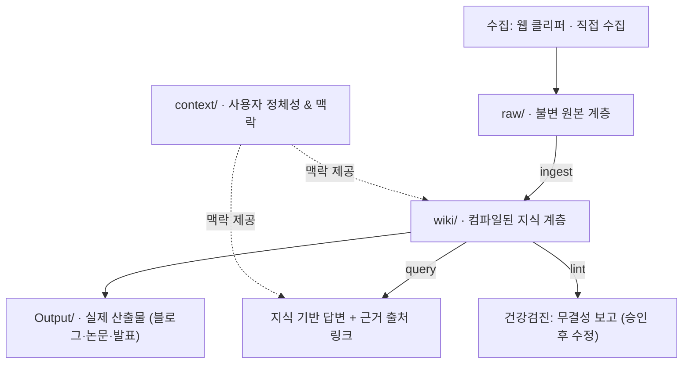

# 🧠 LLM Wiki — 오픈소스 AI 개인 지식 관리 시스템

> **Andrej Karpathy의 LLM Wiki 패턴을 기반으로 구축된, AI가 읽고 유지·발전시키는 개인 위키(Personal Knowledge Management) 프레임워크**

[](https://obsidian.md/)
[](LICENSE)
[]()
[]()
[]()

---

## 📖 목차
1. [프로젝트 소개](#-프로젝트-소개)
2. [핵심 아키텍처 (4계층 구조 & 3대 핵심 연산)](#-핵심-아키텍처)
3. [🚀 처음부터 끝까지: 1부터 시작하는 사용 가이드](#-처음부터-끝까지-1부터-시작하는-사용-가이드)
   - [Step 1. 저장소 다운로드 (Git Clone)](#step-1-저장소-다운로드-git-clone)
   - [Step 2. Obsidian 설치 및 볼트 열기](#step-2-obsidian-설치-및-볼트-열기)
   - [Step 3. 초기 환경 및 나만의 맥락 설정](#step-3-초기-환경-및-나만의-맥락-설정)
   - [Step 4. AI 에이전트 도구 연동](#step-4-ai-에이전트-도구-연동)
   - [Step 5. 자료 수집 도구 설정 (웹 클리퍼 & Zotero)](#step-5-자료-수집-도구-설정-웹-클리퍼--zotero)
   - [Step 6. 실전 사용 워크플로우 (튜토리얼)](#step-6-실전-사용-워크플로우-튜토리얼)
4. [🖥 로컬 웹 UI (선택)](#-로컬-웹-ui-선택)
5. [📂 폴더 구조 안내](#-폴더-구조-안내)
6. [🔒 프라이버시 및 보안 원칙](#-프라이버시-및-보안-원칙)
7. [📚 상세 설계 문서](#-상세-설계-문서)

---

## 💡 프로젝트 소개

### 왜 LLM Wiki인가?
일반적인 AI 문서 활용(RAG, Retrieval-Augmented Generation)은 **질문할 때마다 원본 문서를 다시 뒤집니다.** 답변이 아무리 훌륭해도 질문이 끝나면 사라지며, 다음 질문은 다시 백지상태에서 시작합니다. **지식이 쌓이지 않는 문제**가 발생합니다.

**LLM Wiki**는 이 문제를 역전시킵니다:
- 원본 자료를 수집하면, **AI가 지식을 구조화하여 위키 페이지로 1차 컴파일**합니다.
- 새로운 자료가 들어올 때마다 기존 위키 페이지를 **비교·교차 검증하며 누적 갱신**합니다.
- 시간이 흐를수록 지식은 링크로 상호 연결되고 더욱 정교해지며, 사용자는 언제든 **정확한 출처가 인용된 최신 지식**을 활용할 수 있습니다.

---

## 🏛 핵심 아키텍처

### 1. 4계층 구조 (4-Layer Structure)



| 계층 | 폴더 | 성격 | 설명 |
|---|---|---|---|
| **원본** | `raw/` | **불변 (Immutable)** | 수집한 자료 원본. 절대 수정·삭제하지 않고 추가만 합니다. |
| **위키** | `wiki/` | **파생 (Derived)** | AI가 컴파일해 유지하는 핵심 지식층. 언제든 재생성 가능합니다. |
| **산출물** | `Output/` | **결과물 (Output)** | 위키 페이지를 근거로 작성된 최종 보고서, 아티클, 강의안. |
| **맥락** | `context/` | **메타 (Meta)** | 사용자의 연구 분야, 아는 것/모르는 것, AI 응답 행동 규칙. |

---

### 2. 3대 핵심 연산 (Core Operations)

AI에게 특정 작업을 지시할 때 표준화된 3가지 스킬을 사용합니다:

1. **`ingest` (흡수·정리)**: `raw/`에 새로 들어온 자료를 분석하여 위키 페이지를 생성하거나 기존 페이지를 갱신합니다. (기존 페이지 우선 갱신 원칙)
2. **`query` (질의·추론)**: 위키 카탈로그(`wiki/index.md`)를 통해 관련 지식을 탐색하고, 명확한 근거 링크(`[[링크]]`)와 함께 답변합니다.
3. **`lint` (건강검진)**: 백링크가 없는 고아 페이지, 깨진 링크, 원문 대비 과도한 해석(팽창률), 출처 부족 페이지를 전수 진단합니다.

### 3. 같은 연산을 부르는 3가지 방법

세 연산은 **하나의 규칙**(`CLAUDE.md` + `.claude/skills/*/SKILL.md`)을 공유합니다.
파이프라인 코드는 그 규칙을 **복사하지 않고 읽어서** 프롬프트로 씁니다.
따라서 어느 경로로 부르든 결과가 같습니다.

| 부르는 방법 | 예시 | LLM 키 | 언제 쓰나 |
|---|---|---|---|
| **AI 에이전트 스킬** | Claude Code에서 `/ingest` | 도구가 이미 가진 것 | 대화하며 판단이 필요할 때 |
| **CLI 스크립트** | `python tools/query.py "질문"` | `.env` | 자동화·반복 작업 |
| **로컬 웹 UI** | `python tools/server.py` → 브라우저 | `.env` | 클릭으로 실행·결과 확인 |

> `lint`만은 LLM이 필요 없습니다 — `tools/lint.py`는 순수 정적 분석입니다.

---

## 🚀 처음부터 끝까지: 1부터 시작하는 사용 가이드

이 프로젝트를 처음 다운로드하여 나만의 AI 위키로 가동하기까지의 전 과정을 1단계부터 상세히 안내합니다.

### Step 1. 저장소 다운로드 (Git Clone)

터미널(PowerShell, Bash 등)을 열고 원하는 디렉터리에서 저장소를 클론합니다:

```bash
git clone https://github.com/CyberSec0108/llm_wiki_opensource_AI.git my-llm-wiki
cd my-llm-wiki
```

---

### Step 2. Obsidian 설치 및 볼트 열기

1. [Obsidian 공식 웹사이트](https://obsidian.md/)에서 본인 운영체제에 맞는 Obsidian을 다운로드하여 설치합니다.
2. Obsidian을 실행하고 **"볼트로 폴더 열기(Open folder as vault)"**를 클릭합니다.
3. 방금 클론받은 `my-llm-wiki` 폴더를 선택합니다.
4. **옵시디언 기본 설정 확인**:
   - 설정(좌측 하단 톱니바퀴) → **핵심 플러그인(Core plugins)**:
     - `파일 탐색기`, `검색`, `빠른 전환기`, `그래프 뷰`, `백링크`, `템플릿(Templates)` 등이 켜져 있는지 확인합니다.
   - 설정 → **템플릿(Templates)**:
     - 템플릿 폴더 경로가 `templates`로 설정되어 있는지 확인합니다.

---

### Step 3. 초기 환경 및 나만의 맥락 설정

템플릿으로 제공되는 파일들을 복사하여 나만의 초기 파일들을 생성합니다.

#### 1) 인덱스 및 로그 초기화
`wiki/` 폴더 안의 예시 파일을 복사하여 초기 파일을 만듭니다:
- `wiki/index.example.md` 복사 ➡️ `wiki/index.md` 생성
- `wiki/log.example.md` 복사 ➡️ `wiki/log.md` 생성

#### 2) 나의 맥락(Context) 설정
`context/` 폴더 안의 예시 파일을 복사하여 나만의 학습/연구 맥락을 작성합니다:
- `context/나의 핵심 맥락.example.md` 복사 ➡️ `context/나의 핵심 맥락.md` 생성
- `context/지금 하는 일.example.md` 복사 ➡️ `context/지금 하는 일.md` 생성

> **💡 `context/나의 핵심 맥락.md` 작성 팁**:
> - **1. 나는 누구인가**: 본인이 공부하거나 연구하는 핵심 축(예: `#frontend`, `#security`, `#data-science` 등)을 2~3개 지정합니다.
> - **4. AI 작업 규칙**: 본인이 이미 '아는 것'과 '모르는 것'을 명시하면, AI가 답변할 때 불필요한 기초 설명은 건너뛰고 어려운 개념은 쉽게 풀어서 설명해줍니다.

---

### Step 4. AI 에이전트 도구 연동

이 볼트는 Claude Code, Claude Desktop, Antigravity, Cursor 등 파일 시스템을 다룰 수 있는 모든 현대적인 AI 도구와 호환됩니다.

- **Claude Desktop / Claude Code 사용 시**:
  - 볼트 루트의 `.claude/skills/` 폴더에 이미 `ingest`, `query`, `lint` 스킬이 정의되어 있습니다.
  - 별도 설정 없이 AI에게 대화창에서 명령할 수 있습니다.
- **기타 AI 도구 (ChatGPT / Gemini / Cursor 등) 사용 시**:
  - 볼트 루트의 `CLAUDE.md` 및 `docs/설계.md`를 프로젝트 컨텍스트/룰(Rules)로 등록하시면 동일하게 강력한 성능으로 작동합니다.

---

### Step 5. 자료 수집 도구 설정 (웹 클리퍼 & Zotero)

LLM Wiki는 2가지 수집 파이프라인을 통해 지식을 축적합니다:

#### 1) 웹 아티클 & 영상 수집: Obsidian Web Clipper
1. 브라우저에 **Obsidian Web Clipper** 확장 프로그램을 설치합니다.
2. `templates/clipper/` 폴더에 6종의 클리퍼 템플릿 JSON이 준비되어 있습니다:
   - `1-아티클.json` ➡️ `raw/articles/`
   - `2-논문.json` ➡️ `raw/papers/`
   - `3-유튜브.json` ➡️ `raw/videos/`
   - `4-책.json` ➡️ `raw/books/`
   - `5-라이트업.json` ➡️ `raw/writeups/`
   - `6-인박스.json` ➡️ `raw/inbox/`
3. 웹 클리퍼 설정에서 해당 JSON 템플릿을 등록하면 메타데이터가 자동으로 포함되어 깔끔하게 스크랩됩니다.

#### 2) 학술 논문 & 전문 도서 수집: Zotero + Better BibTeX
> **💡 PDF를 볼트에 직접 복사하지 않는 이유**:
> 수십 페이지 논문 PDF를 볼트에 넣으면 검색과 인덱스가 오염되고 용량이 급증합니다.
> 따라서 **PDF 원본은 Zotero가 보관**하고, **볼트에는 서지정보 정본(`.md`)만 기록**하는 짝 구조를 채택합니다.

1. [Zotero 공식 사이트](https://www.zotero.org/)에서 Zotero 및 브라우저 커넥터를 설치합니다.
2. [Better BibTeX for Zotero](https://retorque.re/zotero-better-bibtex/installation/) 최신 `.xpi` 플러그인을 다운로드하여 Zotero의 `도구(Tools)` → `플러그인(Add-ons)`에서 설치합니다.
3. 논문을 수집하면 Better BibTeX가 표준 `citationKey`(예: `ghosh2026autoprov`)를 자동 생성합니다.
4. `templates/원본 헤더 - 논문.md`를 복사하여 `raw/papers/<검색할이름>.md` 정본 노트를 만들고, `cite_key`와 `zotero_key`를 기재합니다.
5. 위키에서 인용할 때는 `^[cite_key, §3.2]` 형태로 절/페이지 단위 정밀 인용을 수행합니다.

---

### Step 6. 실전 사용 워크플로우 (튜토리얼)

이제 모든 준비가 끝났습니다! 실제로 지식을 축적하는 5단계 사이클을 따라해보세요.

```
자료 수집(raw/) ──> /ingest ──> 지식 축적(wiki/) ──> /query & Output ──> /lint 점검
```

> 아래는 **AI 에이전트에게 대화로 지시하는** 방법입니다.
> 같은 사이클을 브라우저에서 클릭으로 돌리고 싶다면 [로컬 웹 UI](#-로컬-웹-ui-선택)를 보세요.

#### ① 자료 수집
웹 클리퍼나 Zotero를 통해 `raw/inbox/` 또는 `raw/articles/`, `raw/papers/` 등에 자료를 수집합니다.

#### ② 지식 인제스트 (`/ingest`)
AI 도구에게 아래와 같이 요청합니다:
> *"raw/papers/Auto-Prov.md 파일을 ingest해줘"*

**AI의 동작**:
1. 기존 위키 목차(`wiki/index.md`)를 먼저 검토하여 중복되거나 연결할 수 있는 기존 페이지가 있는지 대조합니다.
2. 기존 페이지가 있다면 새로운 내용을 반영하여 업데이트하고, 새로운 핵심 개념이라면 새 위키 페이지를 작성합니다.
3. 주장에 대한 출처 마커(`^[raw/...]`)를 달고, `wiki/log.md`와 `wiki/index.md`를 자동으로 최신 상태로 갱신합니다.

#### ③ 지식 기반 질의 (`/query`)
궁금한 점이 생겼을 때 AI에게 질의합니다:
> *"query: 내가 수집한 지식을 바탕으로 자율형 AI의 보안 위협과 대응 방안을 설명해줘"*

**AI의 동작**:
1. `wiki/index.md`에서 관련 페이지들을 먼저 탐색합니다.
2. 축적된 `wiki/` 문서들을 근거로 들어 답변하며, 반드시 인용된 위키 문서(`[[문서명]]`)를 링크로 제시합니다.
3. 위키에 없는 내용이라면 지어내지 않고 솔직하게 "위키에 없음"을 밝힙니다.

#### ④ 위키 건강검진 (`/lint` & `tools/lint.py`)
자료가 쌓이면 주기적으로 위키의 건강 상태를 점검합니다:
- **CLI 직접 실행**: 터미널에서 `python tools/lint.py` 실행
- **AI 도구에게 요청**: *"위키 전체에 대해 lint를 실행해줘"*

**검사 항목**:
- 고아 페이지 (백링크가 0개인 페이지)
- 깨진 링크 (존재하지 않는 페이지를 가리키는 링크)
- 파일명 축 접두어(`(AI활용)`, `(AI보호)`) 일치 여부
- 원문 대비 자의적 해석 분량이 과도한 페이지 (팽창률 위반)
- 출처가 1개뿐인 얇은 페이지 (`needs_source: true`)
검사 결과는 `reports/lint-YYYY-MM-DD.md`로 깔끔하게 보고서가 생성됩니다.

#### ⑤ 산출물 작성 (`Output/`)
위키에 지식이 충분히 쌓이면 보고서, 블로그 글, 강의 자료를 만듭니다:
> *"위키의 에이전틱 AI 관련 문서들을 기반으로 초급 개발자를 위한 기술 블로그 초안을 Output/에 작성해줘"*

---

## 🖥 로컬 웹 UI (선택)

**이 볼트는 웹 UI 없이도 완전히 동작합니다.** Obsidian·git·Claude Code만으로 충분합니다.
웹 UI는 *Obsidian이 못 하는 것*, 즉 **연산을 실행하고 결과를 보는 일**만 담당합니다.
읽기·검색은 넣되 **편집과 그래프는 만들지 않고** `obsidian://` 링크로 넘깁니다.

### 1) 설치

```bash
pip install -r requirements.txt
```

| 패키지 | 쓰는 곳 |
|---|---|
| `fastapi` · `uvicorn` | 웹 UI 서버 |
| `python-multipart` | 「자료 넣기」 탭의 파일 업로드 |
| `markdown` | 「위키」 탭의 읽기 전용 렌더 |
| `openai` | OpenRouter 호출 (OpenAI 호환 API) |
| `anthropic` | Anthropic 직접 호출 |

> LLM 제공자 두 개는 **`.env`의 `LLM_PROVIDER`에 맞는 것 하나만** 있으면 됩니다.
> `requirements.txt`의 주석이 영어인 이유는 pip이 이 파일을 **OS 기본 인코딩**으로 읽기 때문입니다
> (한글 Windows는 cp949 → 한글 주석이 있으면 설치가 깨집니다).

### 2) 키·모델 설정

`.env.example`을 `.env`로 복사한 뒤 키를 채웁니다. **설정은 이 파일 하나가 정본입니다.**

```bash
cp .env.example .env      # Windows PowerShell: copy .env.example .env
```

```ini
LLM_PROVIDER=openrouter          # openrouter | anthropic
LLM_MODEL=anthropic/claude-sonnet-4.5   # OpenRouter는 키 하나로 여러 모델을 씁니다
LLM_REASONING=low                # low | medium | high | none
OPENROUTER_API_KEY=sk-or-...
```

**모델별 인제스트 1건 실측** (논문 1건, 입력 43K · 출력 17K 기준):

| 모델 | 1건 비용 | 비고 |
|---|---|---|
| `anthropic/claude-sonnet-4.5` | ~$0.35 | **기본값.** 어려운 논문까지 무난합니다 |
| `google/gemini-3.7-flash` | ~$0.09 | 중간 |
| `z-ai/glm-5.3-flash` | **$0.007** | 가장 쌉니다. 1.31M 컨텍스트 |

> 비용을 먼저 줄이고 싶다면 `LLM_MODEL=z-ai/glm-5.3-flash`로 시작해도 됩니다.
> 위 실측치($0.0074 / 약 5분 / 논문 1건)가 이 모델로 측정한 값입니다.

> **모델 선택 주의**: 반드시 **structured outputs(`json_schema`)를 지원하는 모델**이어야 합니다.
> 스키마 없이 부르면 JSON 대신 YAML이나 산문을 뱉는 모델이 있습니다(실측 확인).
> 최신 목록·가격은 [openrouter.ai/models](https://openrouter.ai/models)에서 확인하세요.

> **추론 토큰 주의**: 추론 모델은 "생각"이 출력 토큰에 포함됩니다.
> 기본 설정에서 첫 답변 토큰까지 **47초**가 걸린 적이 있고, 그 중 청크 1,437개가 전부 생각이었습니다.
> 그래서 `LLM_REASONING=low`로 시작합니다. 답변 품질이 아쉬우면 `medium`으로 올리세요.

연결이 되는지 먼저 싸게 확인합니다:

```bash
python tools/llm.py test
```

### 3) 실행

```bash
python tools/server.py              # http://localhost:5000
python tools/server.py --port 8000
python tools/server.py --lan        # 같은 와이파이의 다른 기기에서 접속
```

### 4) 탭 구성

| 탭 | 하는 일 |
|---|---|
| **상태판** | 페이지 수, 연구 축 분포, 마지막 lint 결과, 다음에 만들 페이지 |
| **자료 넣기** | Zotero 라이브러리에서 가져오거나 URL·파일로 `raw/`에 추가 |
| **위키** | 위키·원본 읽기 전용 뷰어 + 본문 검색. 편집은 `obsidian://`로 넘김 |
| **인제스트** | 대기 중인 자료를 확인하고 실행 → **적용 전에 diff를 먼저 보여줌**. 특히 *지워지는 줄*을 따로 뽑아줍니다 |
| **질문** | 위키를 근거로 질의. 토큰 스트리밍·추론 과정 표시·중단·출처 드로어 |
| **점검** | lint 실행 및 심각도별 결과. 예외 처리는 `lint-ignore.json`에 파일로 남음 |

### 5) 설계상의 제약 (의도적)

- **파일이 정본입니다.** 서버가 만드는 상태도 전부 파일입니다 — `queue.md`, `lint-ignore.json`, `reports/`. DB는 쓰지 않습니다.
- **규칙을 코드에 복사하지 않습니다.** `tools/ingest.py`는 `CLAUDE.md`와 `SKILL.md`를 **읽어서** 프롬프트로 씁니다. 규칙을 고치면 웹 UI도 같이 바뀝니다.
- **서버를 꺼도** Obsidian·git·Claude Code가 그대로 동작합니다.
- **인제스트는 자동 반영하지 않습니다.** 결과를 먼저 보여주고, 적용은 사용자가 누릅니다.

### 6) UI 회귀 검사

브라우저 없이 확인할 수 있게 Node의 `vm`으로 가짜 DOM을 만들어 검사합니다.
(외부 의존성 없음 — Node만 있으면 됩니다.)

```bash
node tools/test/syntax.js     # 인라인 스크립트 파싱
node tools/test/render.js     # 답변 렌더 + 대화가 아래로 쌓이는지
node tools/test/wikilist.js   # 목록 제목 자르기 + 폭 조절 손잡이
```

---

## 📂 폴더 구조 안내

```text
├── .claude/
│   └── skills/           # AI 에이전트 3대 스킬 (ingest, query, lint)
├── .obsidian/            # Obsidian 필수 기본 설정
├── Output/               # 위키를 근거로 작성된 실제 산출물
│   └── CLAUDE.md         # Output 작성 및 관리 규칙
├── context/              # 사용자 맥락 정보
│   ├── 위키 규약.md      # 볼트 전체 공통 타입, 상태, 태그 규약
│   ├── 나의 핵심 맥락.example.md  # 사용자 정체성 템플릿
│   └── 지금 하는 일.example.md    # 현재 작업 현황 템플릿
├── docs/
│   ├── 설계.md           # 볼트의 4계층 아키텍처 및 상세 설계 배경
│   ├── 웹UI 계획.md      # 웹 UI 단계별 계획 — 무엇을 만들고 무엇은 안 만드나
│   └── 질문 탭 개편 계획.md
├── raw/                  # 불변의 원본 수집 자료
│   ├── articles/         # 기술 아티클 원본
│   ├── books/            # 도서 서지정보 및 요약
│   ├── inbox/            # 빠른 임시 수집 폴더
│   ├── notes/            # 사용자 직접 메모
│   ├── papers/           # 학술 논문
│   ├── videos/           # 영상 요약
│   ├── writeups/         # 분석 보고서
│   └── CLAUDE.md         # raw 계층 작업 및 불변성 규칙
├── templates/            # 새 문서 생성을 위한 템플릿
│   ├── clipper/          # 웹 클리퍼용 JSON 템플릿 6종
│   └── ...               # 위키/산출물 템플릿
├── tools/                # CLI 스크립트 + 로컬 웹 UI (선택 사용)
│   ├── llm.py            # 제공자를 아는 유일한 파일 (.env 를 읽는다)
│   ├── ingest.py         # ingest 파이프라인 — SKILL.md 를 읽어 프롬프트로 쓴다
│   ├── query.py          # query 파이프라인 (CLI + 웹 스트리밍)
│   ├── lint.py           # lint — LLM 없이 도는 정적 분석
│   ├── server.py         # 웹 UI 서버 (FastAPI)
│   ├── static/           # 단일 페이지 프런트엔드 (빌드 도구 없음)
│   └── test/             # 브라우저 없는 UI 회귀 검사 (Node vm)
├── wiki/                 # 컴파일된 핵심 지식 계층
│   ├── _archive/         # 폐기/대체된 문서 보관소
│   ├── index.example.md  # 위키 전체 목차 템플릿
│   ├── log.example.md    # 작업 일지 템플릿
│   └── CLAUDE.md         # 위키 작성 및 유지 규칙
├── CLAUDE.md             # 루트 시스템 규칙 및 AI 행동 강령
├── .env.example          # LLM 키·모델 설정 견본 (.env 는 커밋되지 않는다)
├── requirements.txt      # 웹 UI·파이프라인 파이썬 의존성
├── .gitignore            # 개인정보 및 사용자 수집/작성 데이터 보호
└── README.md             # 프로젝트 소개 및 가이드
```

---

## 🔒 프라이버시 및 보안 원칙

- **로컬 퍼스트 (Local-First)**: 모든 원본 자료, 위키 지식, 개인 정보는 사용자의 로컬 컴퓨터에만 머무릅니다.
  - 웹 UI 서버도 기본이 `127.0.0.1`이라 **바깥에서 접속할 수 없습니다.** `--lan`을 직접 붙였을 때만 같은 네트워크에 열립니다.
  - 다만 `ingest`·`query`는 **LLM 제공자에게 본문을 보냅니다.** 민감한 자료라면 어떤 모델을 쓰는지 먼저 확인하세요.
- **강력한 `.gitignore` 보호**:
  - `wiki/*.md` (사용자가 작성한 지식 문서)
  - `raw/*/*` (사용자가 수집한 기사, 책, 논문 등 원본 데이터)
  - `context/나의 핵심 맥락.md`, `context/지금 하는 일.md` (개인 신상 및 진행 업무)
  - `Output/*` (사용자의 최종 산출물)
  - `.env` (LLM API 키) — `.env.example`만 공유됩니다
  위 파일들은 `.gitignore`에 의해 완벽히 보호되므로, 사용자가 마음껏 위키를 채우고 작업하더라도 실수로 GitHub 원격 저장소에 업로드되지 않습니다.

---

## 📚 상세 설계 문서

이 볼트의 세부 철학, Karpathy 패턴의 적용 방식, 상태(`status`) 및 타입(`type`) 시스템의 설계 이유, 과거의 설계 실패와 개선 이력은 [docs/설계.md](docs/설계.md)에 상세히 정리되어 있습니다.

---

## 📄 라이선스

이 프로젝트는 [MIT License](LICENSE)에 따라 자유롭게 사용, 수정, 배포할 수 있습니다.
