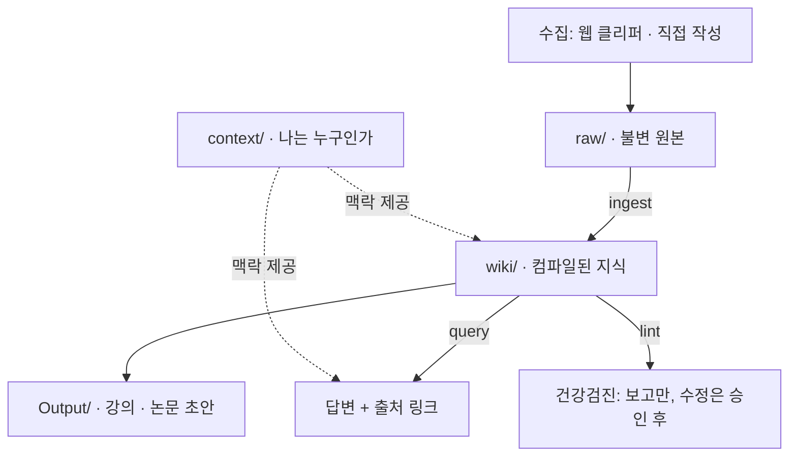
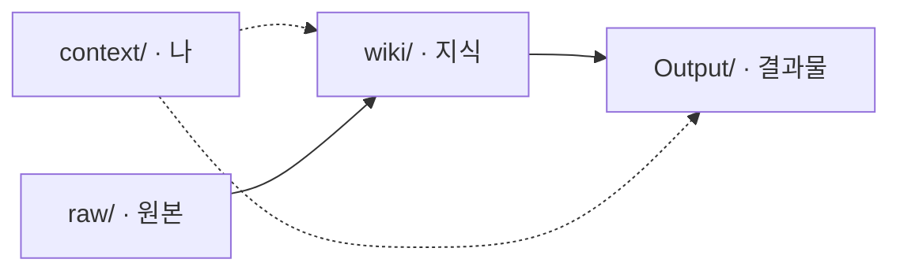
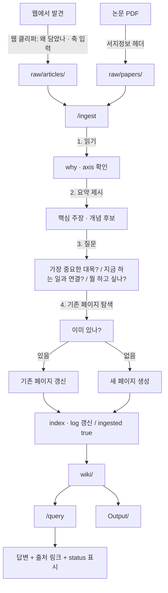
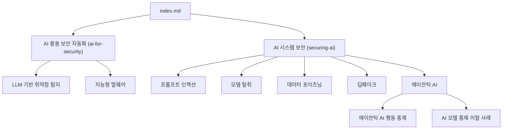

## 한 줄 요약

이 볼트가 어떤 구조이고, 왜 그렇게 만들었으며, 어떻게 작동하는지를 한 곳에 정리한 문서.

> [!note] ✏️ 이 문서의 위치
> 규칙을 **집행**하는 문서가 아니다. 규칙은 각 폴더의 `CLAUDE.md`와 `.claude/skills/`에 있다.
> 이 문서는 그 규칙들이 **왜 그런 모양인지**를 설명한다. 처음 보는 사람(또는 6개월 뒤의 나)이 읽는 용도다.

---

# 1. 한 눈에 보기



**핵심 한 문장**: 원본은 절대 건드리지 않고, 그 위에 **다시 만들 수 있는 지식층**을 쌓는다.

---

# 2. 왜 이렇게 만들었나

## 문제

일반적인 AI 문서 활용(RAG)은 **질문할 때마다 원본을 다시 뒤진다.** 답이 좋아도 사라지고, 다음 질문은 처음부터 다시 시작한다. **쌓이는 게 없다.**

## 해법

**한 번 정리해서 위키로 만들어두고, 그 위키를 계속 갱신한다.**

|               | RAG             | 이 볼트                             |
| ------------- | --------------- | ----------------------------------- |
| 지식          | 질문마다 재발견 | **한 번 컴파일, 계속 재사용** |
| 상호 참조     | 없음            | 이미 링크로 연결돼 있음             |
| 모순          | 발견 안 됨      | `contested` 필드로 추적           |
| 시간이 지나면 | 그대로          | **더 좋아짐**                 |

## 이 볼트만의 추가 목표

위 패턴 자체는 공개된 것이고, 여기에 두 가지를 더했다.

1. **나에게 맞춘다** — `context/`가 "누구를 위한 위키인가"를 담는다
2. **논문에 인용할 수 있게 한다** — `status` 신뢰도와 주장 단위 출처 마커

---

# 3. 4개의 계층



| 계층             | 폴더         | 성격                                  | 지우면?                                  |
| ---------------- | ------------ | ------------------------------------- | ---------------------------------------- |
| **원본**   | `raw/`     | **절대 수정 금지.** 추가만 가능 | **복구 불가** — git이 지키는 대상 |
| **지식**   | `wiki/`    | AI가 컴파일. 파생물                   | 원본에서 다시 만들 수 있음               |
| **결과물** | `Output/`  | 위키를 근거로 만든 글                 | 위키에서 다시 씀                         |
| **맥락**   | `context/` | 나에 대한 정보                        | 나만 다시 쓸 수 있음                     |

## 왜 원본과 지식을 나누는가

**한 파일이 원본이면서 정리본이면, AI가 그걸 고치는 순간 원본이 사라진다.** 잘못 정리했을 때 되돌아갈 자리가 없다.

분리하면 위키는 **언제든 버리고 다시 만들 수 있는 일회용**이 된다. 그래서 위키를 과감하게 재구성할 수 있다.

## 왜 `context/`가 따로 있는가

이게 없으면 AI가 **목적 없이 정리만 한다.** 같은 글이라도 "왜 담았나"에 따라 전혀 다르게 정리돼야 한다.

| `why`가 이거면                              | 위키에 이게 생긴다        |
| --------------------------------------------- | ------------------------- |
| "AI가 보안에**어떻게 쓰이는지** 보려고" | 활용**사례 목록**   |
| "**용어를 익히려고**"                   | **개념** 페이지들   |
| "발표에**인용하려고**"                  | 주장 +**근거** 정리 |

---

# 4. 폴더 지도

```
Sec_Obsidian/
├── CLAUDE.md              ← 항상 로드되는 지시서 (59줄)
│
├── raw/                   ← 원본. 절대 수정 금지
│   ├── CLAUDE.md            불변 규칙 · 서지정보 · 인용키
│   ├── articles/            웹 글, 블로그
│   ├── papers/              논문 (서지정보 필수)
│   ├── books/               책 (페이지 번호 필수)
│   ├── videos/              영상 (타임스탬프 필수)
│   ├── writeups/            취약점 분석, CTF
│   ├── notes/               내가 직접 쓴 메모
│   └── inbox/               분류 전 임시
│
├── wiki/                  ← AI가 컴파일하는 지식
│   ├── CLAUDE.md            페이지 형식 · 중복 방지 · 충돌 처리
│   ├── index.md             전체 카탈로그 (query의 진입점)
│   ├── log.md               append-only 작업 기록
│   ├── _archive/            폐기된 페이지
│   └── (지식 페이지들)
│
├── Output/                ← 결과물
│   └── CLAUDE.md            "모든 주장은 위키 근거 필수"
│
├── context/               ← 나에 대한 정보
│   ├── 나의 핵심 맥락.md      정체성 · 연구 축 · AI 작업 규칙
│   ├── 지금 하는 일.md        현재 작업 (주 단위 갱신)
│   └── 위키 규약.md           type · status · 파일명 공통 정의
│
├── templates/             ← 새 파일 시작용
│   ├── clipper/             웹 클리퍼 JSON 6종
│   └── 원본 헤더 - *.md      매체별 서지 헤더
│
├── docs/                  ← 이 문서
└── .claude/skills/        ← ingest · query · lint
```

## 왜 주제별 폴더로 안 나누는가

`wiki/`는 **평평하다.** `보안/`, `AI/` 같은 하위 폴더가 없다.

**폴더로 나누면 한 페이지가 한 곳에만 속하게 되는데, 지식은 원래 여러 곳에 걸쳐 있다.** [[(AI보호) 프롬프트 인젝션]]은 공격 기법이면서 동시에 에이전트 보안 주제다. 분류는 폴더가 아니라 **태그와 링크**로 한다.

---

# 5. 데이터가 흐르는 길



**두 개의 관문이 있다.**

- **3단계 질문** — 여기서 "왜"를 답하지 않으면 목적 없는 요약이 된다
- **4단계 탐색** — 여기서 기존 페이지를 안 찾으면 중복이 쌓인다

---

# 6. 세 가지 연산

## `/ingest` — 원본을 지식으로

```
0. 미처리 파일 목록 제시 → 어느 것부터 할지 묻기
1. 원본 읽기 → why · axis 확인, 어긋나면 지적
2. 소스 요약 제시 (핵심 주장 · 개념 후보 · 등장 엔티티)
3. 질문 3개 → 답변 전에는 위키를 건드리지 않음
4. 기존 페이지 탐색 (index → 본문 → aliases)
5. 갱신 우선, 새로 만들면 이유를 log에 기록
6. index · log 갱신, ingested: true
```

## `/query` — 지식으로 답하기

```
1. index.md 먼저 → 후보 좁히기 (위키 전체를 읽지 않음)
2. 후보 페이지만 읽고 답변
   - 근거를 [[링크]]로 표시
   - status에 따라 인용 강도 조절
3. 위키에 없으면 "위키에 없음" 명시 후 일반 지식으로
4. 좋은 답변은 위키로 되먹임 (확인 후)
```

## `/lint` — 건강검진

**보고만 한다. 수정은 승인 후.**

31개 체크를 심각도별로 분류: Error / Warning / Info

각 항목에 **무엇이 / 어디서 / 어떻게 고칠지** 세 가지를 다 제시한다.

---

# 7. 페이지 형식

모든 위키 페이지는 이 frontmatter로 시작한다.

```yaml
---
title: 페이지 이름
aliases: [다른 이름, 약어, 영문명]      # 중복 페이지를 막는 1차 방어선
type: concept | howto | reference | log | moc
status: seed | draft | stable            # 신뢰도
source: raw/articles/원본.md             # 여러 개면 리스트
updated: 2026-09-03
contested: false                         # 미해결 모순이 있는가
contradictions: []                       # 충돌하는 상대 페이지
tags: [ai-for-security]                  # 연구 축
---
```

본문 구조:

```
## 한 줄 요약     ← 이것만 읽고 펼칠지 판단할 수 있어야 한다
## 원문 요약      ← 원본에 있는 것만
## 원문 밖 — 내 정리  ← [!inference]로 표시, 원문에 없다고 첫 줄에 밝힌다
## 관련
```

## 필드별 의미

| 필드             | 왜 있나                                                                                                           |
| ---------------- | ----------------------------------------------------------------------------------------------------------------- |
| `status`       | **인용해도 되는지**를 정한다. `seed`는 근거로 못 씀, `draft`는 "검증 필요" 명시, `stable`만 자유 인용 |
| `source`       | 출처 없는 지식은 환각의 씨앗. 비면`stable`로 못 올림                                                            |
| `aliases`      | "SQLi"와 "SQL Injection"이 다른 페이지가 되는 걸 막음                                                             |
| `tags` (축)    | 연구 축 2개 중 어디인지. 자료가 쌓이면 축별로 뽑아볼 수 있음                                                      |
| `contested`    | 모순을**기계가 찾을 수 있게** 함. 본문 표시만으로는 검색이 안 됨                                            |
| `needs_source` | 근거가 얇아 보강이 필요한 페이지                                                                                  |
| `pinned`       | 손으로 쓴 페이지. 자동 갱신에서 제외                                                                              |

## 연구 축

| 태그                | 뜻                         | 영어로                   |
| ------------------- | -------------------------- | ------------------------ |
| `ai-for-security` | **AI로 보안을** 한다 | AI**FOR** Security |
| `securing-ai`     | **AI를 지킨다**      | Security**FOR** AI |
| `both`            | 둘 다 걸침                 |                          |

> [!warning] ⚠️ 실제로 틀렸던 적이 있다
> 한국어 "AI 보안"이 두 뜻을 다 담아서, 자료 3건 중 2건의 축이 서로 뒤바뀌어 있었다.
> **제목이 아니라 본문이 무엇을 보호 대상으로 삼는지**로 판단한다.

---

# 8. 핵심 규칙과 그 이유

| 규칙                                             | 왜                                                                        |
| ------------------------------------------------ | ------------------------------------------------------------------------- |
| **원본은 절대 수정 금지**                  | 잘못 정리했을 때 되돌아갈 유일한 자리                                     |
| **기존 페이지 갱신이 새 페이지보다 우선**  | 안 그러면 "SQL Injection", "SQLi", "SQL 인젝션"이 따로 생김               |
| **새 페이지를 만들면 이유를 log에 남긴다** | 못 쓰겠으면 만들 이유가 없었던 것                                         |
| **링크 2개 이상 필수**                     | 2개를 못 채우면 페이지를 만들 때가 아님. 고립된 지식은 위키가 아니라 메모 |
| **원문과 내 정리를 섞지 마라**             | 섞이면 나중에 무엇을 인용할 수 있는지 알 수 없음                          |
| **모순은 AI가 판정하지 않는다**            | 양쪽을 남기고 사람에게 묻는다                                             |
| **위키에 없으면 "없음"이라고 말한다**      | 이 구분이 무너지면 위키 전체의 신뢰도가 무너짐                            |
| **lint는 보고만 한다**                     | 무엇을 고칠지는 사람이 정한다                                             |

---

# 9. 지금 상태 (2026-09-03)

| 항목                         | 값                       |
| ---------------------------- | ------------------------ |
| 원본                         | 3건 (전부 인제스트 완료) |
| 위키 페이지                  | 11개 (전부`draft`)     |
| 미생성 링크 (= 할 일)        | 10개                     |
| 보강 필요 (`needs_source`) | 4개                      |
| 규칙 분량                    | 775줄                    |
| lint 체크                    | 31개                     |
| git 커밋                     | 7개                      |

## 지도의 두 축



---

# 10. 왜 이런 결정을 했나 (설계 이력)

| 결정                     | 대안                                       | 왜 이쪽을 택했나                                                       |
| ------------------------ | ------------------------------------------ | ---------------------------------------------------------------------- |
| `wiki/`를 평평하게     | 타입별 폴더 (`concepts/`, `entities/`) | 지식은 여러 곳에 속한다. 폴더는 하나만 고르게 강제함                   |
| 엔티티 페이지 안 만듦    | 자동 생성                                  | 11페이지 규모에서 index가 폭발함. 3곳에 나올 때 만듦                   |
| 규칙을 스킬로 분리       | CLAUDE.md에 전부                           | 루트는 매 세션 로드됨. 절차는 필요할 때만                              |
| 얇은 페이지를 병합 안 함 | 즉시 통합                                  | 자료를 붙여 키우는 쪽을 택함.**3개월 타이머**를 걸어 판단을 예약 |
| `status` 3단계 도입    | 없음                                       | 논문 인용 가능성을 구분해야 함                                         |
| 주장 단위 출처 마커      | 페이지 단위`source`만                    | 어느 문장이 어느 원본인지 몰라 논문에 못 씀                            |

## 실제로 겪은 실패 3가지

1. **팽창률 92%** — 위키가 원본만큼 커졌다. 정리가 아니라 재작성을 하고 있었음
   → `## 원문 요약` / `## 원문 밖` 분리로 해결
2. **축 오분류 2건** — "AI 보안"의 두 뜻을 혼동
   → 판별 가이드를 `/ingest`에 박음
3. **lint 오탐 3건** — 규칙 예시 문자열이 검사에 걸림
   → 제외 규칙 명시

---

# 11. 다른 시스템과 비교

|                | 이 볼트             | 2nd-brain-template    | OpenKB          | nashsu/llm_wiki       |
| -------------- | ------------------- | --------------------- | --------------- | --------------------- |
| 형태           | 볼트 + 규칙         | 규칙 계약서           | Python CLI + 웹 | 데스크톱 앱           |
| 개인 맥락      | 있음 (`context/`) | 없음                  | 없음            | 있음 (`purpose.md`) |
| 신뢰도         | 있음 (`status`)   | 있음 (`confidence`) | 없음            | 없음                  |
| 주장 단위 출처 | 있음                | 있음                  | 없음            | 없음                  |
| 원문/해석 분리 | 있음                | 부분                  | 없음            | 없음                  |
| 무결성 해시    | 없음                | 있음 (`sha256`)     | 없음            | 있음 (캐시용)         |
| 자동 수집      | 클리퍼만            | 없음                  | 있음            | 있음                  |
| 웹 UI          | 없음                | 없음                  | 있음            | 있음                  |
| 재컴파일       | 없음                | 없음                  | 있음            | 있음                  |

**강점**: 개인 맥락 · 신뢰도 · 출처 추적 · 원문/해석 분리 — **논문에 필요한 것들**

**약점**: 자동화가 전무하다. 전부 손과 대화로 한다

---

# 12. 도구를 추가할 때 — 파일이 정본이다

웹 UI·스크립트·플러그인을 붙일 때 지키는 원칙이다. 루트 `CLAUDE.md`에 규칙으로 있고,
여기엔 **왜 그런지**를 적는다.

```
웹 UI ─┐
Obsidian ─┼─→  같은 마크다운 파일
Claude Code ─┘
```

## 세 조항

| 조항 | 어기면 |
|---|---|
| 도구가 만드는 상태도 **전부 파일** | 터미널·Obsidian에서 안 보임 |
| 규칙을 코드에 **복사하지 않는다** | 규칙을 고칠 때 한쪽만 옛날 규칙으로 |
| 도구를 꺼도 **나머지가 동작한다** | 도구가 곧 시스템이 됨 |

## 실제 사례

`tools/lint.py`가 이 원칙으로 만들어졌다.

```
터미널   python tools/lint.py
웹 UI    [실행] 버튼 → 같은 스크립트를 subprocess로
```

같은 코드가 돌고 결과도 같은 `reports/`에 떨어진다.

## 반례 — 참고 프로젝트

`Raymonda/LLM-WIKI`는 **MySQL이 정본**이다. 그래서 강력한 웹 UI를 가졌지만,
**웹 UI 없이는 아무것도 못 한다.** Obsidian·git·Zotero가 붙지 않는다.

우리는 마크다운이 정본이라 도구가 늘어도 기존 경로가 살아 있다.

## 두 번째 조항이 중요한 이유

이 세션에서만 규칙을 10번 넘게 고쳤다 — 축 태그, `description`, 파일명 접두어,
주제 태그, 고유명사 예외, 생성 기준. **규칙 사본이 있었다면 전부 갈라졌을 것이다.**

실제로 `tools/lint.py`를 만들기 전, 즉석 검사 스크립트가 규칙과 갈라져
**같은 원인의 오탐이 세 번 반복됐다.**

# 13. 아직 안 한 것

| 항목                                      | 어디서 배웠나 | 언제 할까                   |
| ----------------------------------------- | ------------- | --------------------------- |
| **Review 큐** (비동기 판단)         | nashsu        | 자료가 5건 넘게 쌓일 때     |
| **2단계 인제스트** (분석/생성 분리) | nashsu        | 다음 인제스트 때            |
| **`overview.md`** (논지 요약)     | nashsu        | 페이지 20개 넘을 때         |
| **lint 검사기 파일화**              | OpenKB        | 오탐이 또 나오면            |
| **`recompile` 실증**              | OpenKB        | "재생성 가능"이 아직 미검증 |
| **PageIndex** (긴 PDF 트리)         | OpenKB        | 논문이 들어올 때            |
| **지식 공백 지표** (degree 1 이하)  | nashsu        | lint 개선 시                |

---

## 관련

- [[나의 핵심 맥락]] — 왜 이 위키를 운영하는가
- [[위키 규약]] — type · status · 파일명 정의
- [[index]] — 위키 카탈로그
